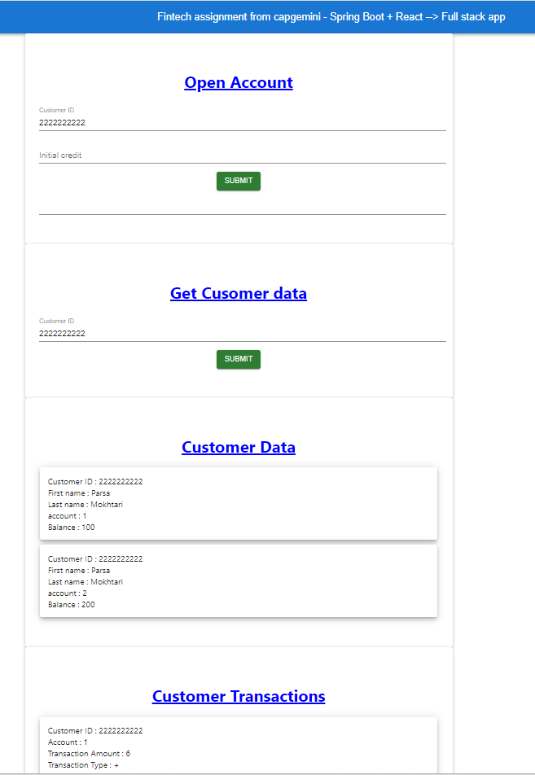

# 1. User story:

The assessment consists of developing an API to be used for opening a new account of already existing customers.<br>

## Requirements<br>

    • The API will expose an endpoint which accepts the user information for opening a new account, naming, customerID, and initialCredit
    • Once the endpoint is called, a new account will be opened connected to the user whose ID is customerID.
    • Also, if initialCredit is not 0, a transaction will be sent to the new account.
    • Another Endpoint will output the user information showing Name, Surname, balance, and transactions of the accounts.

## Bonuses

    • Accounts and Transactions are different services.
    • Frontend (simple one is OK).
    • Attention to CI/CD

# 2. Architecture, Design, and Development

System is developed as a full stack system in which, the backend is developed with Spring Boot and hosted on [www.Railway.app](https://www.Railway.app) and the frontend is developed with React js and is hosted on [www.netlify.app](https://www.netlify.app). here follows the addresses of the back-end and front-end:

BackEnd:  [https://fintechapp-production.up.railway.app/](https://fintechapp-production.up.railway.app/)<br>
Frontend: [https://63cd774dc2544253ff254d8a--glistening-biscotti-fb2639.netlify.app/](https://63cd774dc2544253ff254d8a--glistening-biscotti-fb2639.netlify.app/)<br>

## 2.1 Backend

Expose below Rest URLS: <br>
1./openaccount/{customerID}/{initialCredit} - Request for Opening a new account for the customer recognised by customerID, then if initialCredit is not zero, initiate a transaction <br>
2./userinformation/{customerID} - Requests for the customer information consisting personal info + accounts <br>
3./accounttxn/{customerID}/{account} - Requests for the transactions on the specific customer and specific account number<br>

### 2.1.1 Tools, Technologies, and Frameworks

    * Intellij IDEA (Comunity ed.)
    * Spring Boot (using Spring initializer)
    * Test Driven Development (TDD) approach. JUnit used as test framework
    * Spring Transaction managment
    * CI/CD by hosting on Railway.app
    * Spring Security is added however, is excluded from    execution for now to see if I will have enough time to implement authentication for REST API using JWT!

### 2.1.2 TDD

Please note that I used development with TDD approach however, due to time constraint, it is applied for the beginning of the project and not consisting the whole system! You will see this in the history of git. I used MockMVC and JUnit for this purpose.

### 2.1.3 Architecture

A very common Spring Web architecture is used for the system, consisting the typical layers of controller, service, model and repository.

### 2.1.4 DataBase

For easy test and deployment, in-memory DB, H2, is used. Please refer to the entity calsses for the structure of the database. each customer can have multiple accounts, therefore, customer table can have multiple rows for a specific customer with unque index on the combination of customer ID and account number.

When endpoint "/openaccount" is called, a record is inserted in the request table. It can be repeated with the same values, because when a request is sent, system searches in the account table for the latest account number of the user and automatically creats a new account with a new account number equal to the next account sequence! For example if the customer has 3 accounts and the last account number is 3, system automatically creats a new account number of 4. Then account is saved in the table named accounts with balance of 0. Then, a transaction is created with the amount equal to the requested initial credit and updates the balance of the account in accounts table as well.

It is assumed that each customer ID is a 10 digit number and a few customers together with arbitarury data are inserted to respective tables when system is started:

```sql
INSERT INTO new_account_request (customer_ID, initial_credit) VALUES
    ('1111111111', '1'),
    ('2222222222', '2'),
    ('3333333333', '3'),
    ('4444444444', '4');

INSERT INTO customer (customer_ID, first_name, last_name) VALUES
    ('1111111111', 'Reza',     'Mokhtari'),
    ('2222222222', 'Parsa',    'Mokhtari'),
    ('3333333333', 'Parastoo', 'Mokhtari'),
    ('4444444444', 'Hanieh',   'Mokhtari');

INSERT INTO accounts (customer_ID, account, balance) VALUES
    ('1111111111', '1', '100'),
    ('2222222222', '1', '100'),
    ('2222222222', '2', '200'),
    ('3333333333', '1', '100'),
    ('3333333333', '2', '200'),
    ('3333333333', '3', '300'),
    ('4444444444', '1', '100'),
    ('4444444444', '2', '200'),
    ('4444444444', '3', '300'),
    ('4444444444', '4', '400');

INSERT INTO transactions (customer_ID, account, txn, txn_amount, date_time, balance_after_txn) VALUES
    ('1111111111', '1', '+', '2', '2023-01-01 11:37:58-08:00', '3'),
    ('1111111111', '1', '-', '2', '2023-01-02 11:37:58-08:00', '2'),
    ('2222222222', '1', '+', '6', '2023-01-03 11:37:58-08:00', '3'),
    ('2222222222', '1', '-', '3', '2023-01-04 11:37:58-08:00', '2'),
    ('3333333333', '1', '+', '10','2023-01-05 11:37:58-08:00', '3'),
    ('3333333333', '1', '-', '3', '2023-01-06 11:37:58-08:00', '2'),
    ('4444444444', '1', '+', '7', '2023-01-09 11:37:58-08:00', '3'),
    ('4444444444', '1', '-', '8', '2023-01-10 11:37:58-08:00', '2');

```

Transactions are managed with Spring Boot transaction Management.

### 2.1.5 CI/CD

the system is hosted on Rialway.app and everytime a new commit is pushed from local git to the github repo, the system is deployed again.

## 2.2 Frontend

Frontend is developed with React JS. it is hosted on Netlify cloud and the apperaince looks like:

### 2.2.1 Apperaince



Working with the UI is quite easy and strightforward!

### 2.2.2 CI/CD

The Frontend is hosted on Netlify via Github therefore, when a new commit is pushed to the github repo, the frontend is re-deployed!
